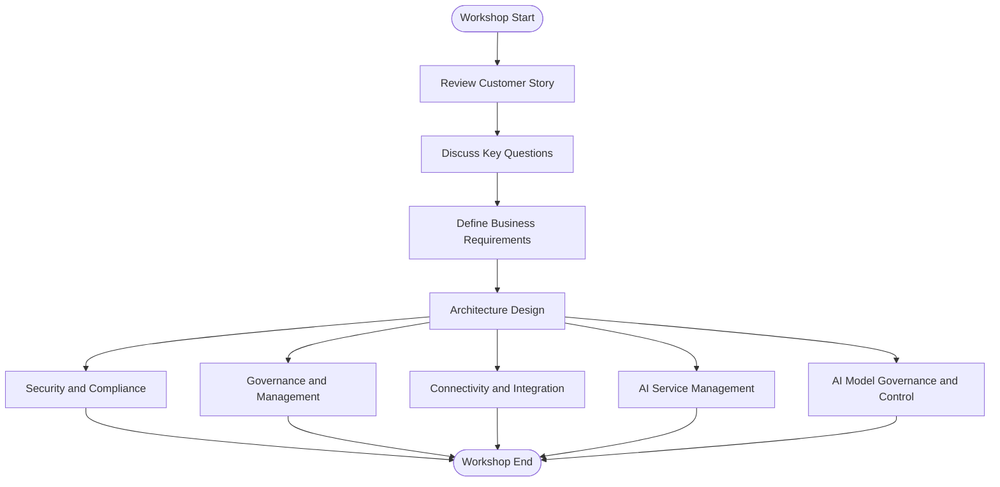

# AI Hub and Azure Landing Zones - Whiteboard Design Session

## Overview

This whiteboard design session provides attendees with a practical scenario to design a secure, scalable Azure architecture supporting AI adoption for Contoso Health, a regional healthcare provider.

Participants will analyze the customer's business objectives, strategic vision, and current challenges. They will then define clear business requirements and address technical challenges by designing Azure architectures aligned with Azure best practices, the Microsoft Cloud Adoption Framework, and Azure Well-Architected Framework.

## Workshop Delivery Flowchart

The following flowchart illustrates the structured approach for delivering this whiteboard design session:

## Session Structure

The session is divided into three main steps:

1. **Analyze Customer Needs** (15 minutes)
   - Review the provided [Customer Story](./wds/contoso-health-customer-story.md).
   - Identify key business objectives, AI use cases, and success metrics.

2. **Define Business Requirements** (30 minutes):
   - Security and compliance
   - Governance and management
   - Connectivity and integration
   - AI service management
   - AI model governance and control
   - Data security and privacy
   - Operational efficiency
   - Cost optimization
   - Scalability

3. **Address Technical Challenges** (2 hours):
   - Design Core Cloud Environment
   - Design Workload Hosting Environment
   - Design Centralized AI Management Environment

4. **Present Deliverables**:
   - High-level architecture diagrams
   - Azure services list and roles
   - Implementation plans (deployment, migration, governance, security, AI model governance)
   - Risk assessment and mitigation strategies

## Deliverables

Participants will produce:

- High-level architecture diagrams.
- Azure services list and roles.
- Implementation plans (deployment, migration, governance, security, AI model governance).
- Risk assessment and mitigation strategies.

## Intended Audience

This session is intended for cloud architects, solution architects, IT professionals, and technical decision-makers interested in Azure architecture, AI adoption, and cloud governance.

## Workshop Delivery Flowchart
The following flowchart illustrates the structured approach for delivering this whiteboard design session:

## References

* [Microsoft Cloud Adoption Framework for Azure](https://learn.microsoft.com/en-us/azure/cloud-adoption-framework/)
* [Azure Cloud Adoption Framework - AI Scenario](https://learn.microsoft.com/en-us/azure/cloud-adoption-framework/scenarios/ai/)
* [Azure OpenAI baseline Landing Zone reference architecture](https://learn.microsoft.com/en-us/azure/architecture/ai-ml/architecture/azure-openai-baseline-landing-zone) *(For facilitator reference - attendees should derive principles)*
* [AI Hub Gateway Solution Accelerator Concept](https://github.com/Azure-Samples/ai-hub-gateway-solution-accelerator/tree/main) *(For facilitator reference)*
