# Workshop: Designing an End-to-End Azure AI Solution

**Version:** 1.0  
**Date:** 2025-04-10  

## Overview

This workshop guides participants through the end-to-end process of designing a secure, scalable, and governed AI solution on Microsoft Azure, aligning with the Microsoft Cloud Adoption Framework (CAF) and Azure Well-Architected Framework (WAF) principles.

Starting with a realistic customer scenario (Innovate Financial Services - IFS), participants will first design the foundational Azure platform using Azure Landing Zones concepts, including a specialized AI Hub for governed access to AI services. Subsequently, they will design a specific AI workload – an internal RAG (Retrieval-Augmented Generation) chatbot – that leverages this platform foundation.

**Goal:** To equip participants with the knowledge and design patterns necessary to architect robust enterprise AI solutions on Azure, from the underlying platform infrastructure to the specific AI application components.

## Workshop Flow

```mermaid
graph TD
    Start[🍀 Start: IFS AI Architecture Design] --> Phase01
    Phase01[Phase 01: Define AI Strategy] --> Motivations
    Phase01 --> Mission
    Phase01 --> Objectives
    Motivations --> Phase02
    Mission --> Phase02
    Objectives --> Phase02

    Phase02[Phase 02: Design AI Platform] --> ResourceHierarchy
    Phase02 --> NetworkingPlatform
    Phase02 --> GovernancePlatform
    Phase02 --> ManagementPlatform
    Phase02 --> SecurityPlatform
    ResourceHierarchy --> Phase03Workload
    NetworkingPlatform --> Phase03Workload
    GovernancePlatform --> Phase03Workload
    ManagementPlatform --> Phase03Workload
    SecurityPlatform --> Phase03Workload

    Phase03Workload[Phase 03: Design AI Workload] --> UseCases
    Phase03Workload --> PromptFlow
    Phase03Workload --> Components
    Phase03Workload --> WellArchitectedConsiderations
    UseCases --> Phase03Environment
    PromptFlow --> Phase03Environment
    Components --> Phase03Environment
    WellArchitectedConsiderations --> Phase03Environment

    Phase03Environment[Phase 03: Design AI Environment] --> SubscriptionSetup
    Phase03Environment --> NetworkingEnvironment
    Phase03Environment --> DataGovernance
    Phase03Environment --> AIModelGovernance
    Phase03Environment --> ManagementEnvironment
    Phase03Environment --> SecurityEnvironment
    SubscriptionSetup --> Phase03Integration
    NetworkingEnvironment --> Phase03Integration
    DataGovernance --> Phase03Integration
    AIModelGovernance --> Phase03Integration
    ManagementEnvironment --> Phase03Integration
    SecurityEnvironment --> Phase03Integration

    Phase03Integration[Phase 03: AI Workload Landing Zone Integration] --> Phase04
    Phase04[Phase 04: End-to-End Review & Justification] --> Phase05
    Phase05[🍺 Phase 05: Beer o'clock]

    %% Colors for phases
    style Phase01 fill:#ffcc99,stroke:#333,stroke-width:2px
    style Motivations fill:#ffcc99
    style Mission fill:#ffcc99
    style Objectives fill:#ffcc99

    style Phase02 fill:#99ccff,stroke:#333,stroke-width:2px
    style ResourceHierarchy fill:#99ccff
    style NetworkingPlatform fill:#99ccff
    style GovernancePlatform fill:#99ccff
    style ManagementPlatform fill:#99ccff
    style SecurityPlatform fill:#99ccff

    style Phase03Workload fill:#ff9999,stroke:#333,stroke-width:2px
    style UseCases fill:#ff9999
    style PromptFlow fill:#ff9999
    style Components fill:#ff9999
    style WellArchitectedConsiderations fill:#ff9999

    style Phase03Environment fill:#ffccff,stroke:#333,stroke-width:2px
    style SubscriptionSetup fill:#ffccff
    style NetworkingEnvironment fill:#ffccff
    style DataGovernance fill:#ffccff
    style AIModelGovernance fill:#ffccff
    style ManagementEnvironment fill:#ffccff
    style SecurityEnvironment fill:#ffccff

    style Phase03Integration fill:#ffff99,stroke:#333,stroke-width:2px

    style Phase04 fill:#c2f0c2,stroke:#333,stroke-width:2px
    style Phase05 fill:#b3b3ff,stroke:#333,stroke-width:2px

    style Start fill:#f96,stroke:#333,stroke-width:2px
```

## Modules

### Module 1: Understanding the Business Need (CAF: Strategy & Plan)

**Objective:** Analyze the customer's (IFS) business drivers, challenges, goals, and specific AI use cases.

**Activities:**  
- Review the customer story.  
- Identify key objectives, success metrics, and initial high-level requirements.

**Materials:**  
- [Customer Story](./wds/ifs-customer-story.md)

---

### Module 2: Designing the Azure AI Platform Foundation (CAF: Ready, Govern, Manage | WAF: Security, Reliability, OpEx)

**Objective:** Design a secure, scalable, and well-governed Azure foundation using Landing Zone principles to support IFS's current needs and future AI adoption. This includes designing a central, secure "AI Hub" for managing and accessing shared AI services like Azure OpenAI and Azure AI Search.

**Activities:**  
- Define platform requirements (security, governance, connectivity, AI service management).  
- Design the Landing Zone structure (Platform & Application LZs).  
- Architect the AI Hub with private networking (Private Endpoints, secure gateway).  
- Select core platform services.

**Key Concepts:**  
- Subscription democratization.  
- Identity management.  
- Network topology (Hub-Spoke).  
- Private networking.  
- Azure Policy.  
- Azure Monitor.  
- Centralized AI service governance.

**Materials:**  
- [Platform WDS](./wds/ifs-alz-challenge-session.md)

---

### Module 3: Designing the AI Workload - RAG Chatbot (CAF: Adopt, Secure, Manage | WAF: Perf. Efficiency, Cost Opt., Reliability)

**Objective:** Design the specific "IFS Knowledge Assistant" RAG chatbot application, ensuring it leverages the platform foundation securely and efficiently.

**Activities:**  
- Define workload requirements.  
- Design the application architecture (UI, backend/orchestration, data sources).  
- Select appropriate Azure services for hosting components (e.g., App Service, ML Endpoints).  
- Design the RAG pipeline.  
- Implement security controls (Managed Identities, Key Vault).  
- Plan for monitoring.  
- Outline deployment strategies (IaC, CI/CD).

**Key Concepts:**  
- RAG pattern.  
- Prompt Flow.  
- Azure OpenAI.  
- Azure AI Search.  
- App Service.  
- ML Managed Online Endpoints.  
- Application Gateway.  
- VNet Integration.  
- Private Endpoints.  
- Managed Identities.  
- Application Insights.  
- IaC (Bicep).

**Materials:**  
- [AI Workload WDS](./wds/ifs-rag-challenge-session.md)

---

### Module 4: End-to-End Review & Justification

**Objective:** Consolidate the platform and workload designs into a cohesive end-to-end solution.

**Activities:**  
- Present the final architecture, justifying design choices based on requirements, CAF principles, and WAF pillars.  
- Discuss potential risks and mitigation strategies.

---

## Key Principles Emphasized

- **Cloud Adoption Framework (CAF):** Applying guidance across Strategy, Plan, Ready, Adopt, Govern, Manage, and Secure phases.  
- **Well-Architected Framework (WAF):** Designing solutions considering the five pillars: Cost Optimization, Operational Excellence, Performance Efficiency, Reliability, and Security.  
- **Security:** Defense-in-depth, private networking, identity-based access control, secure secrets management.  
- **Governance:** Centralized policy enforcement, cost management, resource organization.  
- **Scalability & Reliability:** Designing for growth and resilience.  
- **Automation:** Utilizing Infrastructure as Code (IaC) and CI/CD practices.

---

## Prerequisites

- Familiarity with fundamental Azure concepts (Subscriptions, Resource Groups, Networking, PaaS services).  
- Basic understanding of AI/ML concepts (LLMs, RAG is helpful but not essential).  
- Experience with architectural design discussions.

---

## Workshop Materials

- [Scenario definition for Innovate Financial Services.](./wds/ifs-customer-story.md)
- [Whiteboard Design Session guide for the Platform Foundation & AI Hub.](./wds/ifs-alz-challenge-session.md)
- [Whiteboard Design Session guide for the RAG Chatbot Workload.](./wds/ifs-rag-challenge-session.md)
- Presentation slides for this workshop.
---

## References

* [Microsoft Cloud Adoption Framework for Azure](https://learn.microsoft.com/en-us/azure/cloud-adoption-framework/)
* [Azure Cloud Adoption Framework - AI Scenario](https://learn.microsoft.com/en-us/azure/cloud-adoption-framework/scenarios/ai/)
* [Azure OpenAI baseline Landing Zone reference architecture](https://learn.microsoft.com/en-us/azure/architecture/ai-ml/architecture/azure-openai-baseline-landing-zone) *(For facilitator reference - attendees should derive principles)*
* [AI Hub Gateway Solution Accelerator Concept](https://github.com/Azure-Samples/ai-hub-gateway-solution-accelerator/tree/main) *(For facilitator reference)*